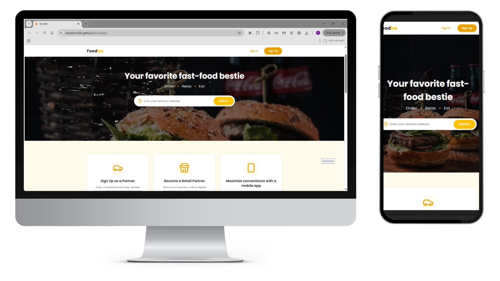

# 🍔 Foodizo

A modern, highly responsive web application built to streamline the food browsing and ordering experience. 

---

### 📱 Project Previews


---

## 🚀 Live Demo
Experience the application live in your browser! 

👉 **[Click here to view the live Foodizo Web Page](https://shepherd-bit.github.io/Foodizo/)**

*(This project utilizes an automated CI/CD pipeline via GitHub Actions. Any updates pushed to the main branch are instantly compiled and deployed to the live link above!)*

---

## ✨ Features
* **Intuitive UI/UX:** Clean, modern interface designed for effortless navigation.
* **Component-Driven Architecture:** Built with reusable, modular React components for optimal scalability.
* **Fully Responsive:** Completely optimized for mobile, tablet, and desktop viewports.

---

## 🛠️ Tech Stack
* **Frontend Library:** React
* **Build Tool:** Vite
* **Styling:** CSS3
* **Deployment:** GitHub Pages / GitHub Actions

---

## 💻 Local Setup & Installation

If you would like to clone this project and run it locally on your machine, follow these simple steps:

1. **Clone the repository:**
```bash
   git clone [https://github.com/shepherd-bit/Foodizo.git](https://github.com/shepherd-bit/Foodizo.git)